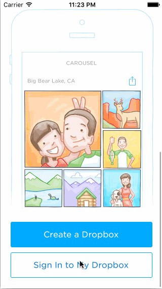

# Week 2 Assignment - *Carousel*
Click-through flow of Carousel

Submitted by: Sam Huskins
Time spent: 8 hours spent in total

## User Stories
**Required:**
* [x] Static photo tiles on the initial screen
* [x] Sign In
* [x] Tutorial Screens
* [x] Image Timeline
* [x] Conversations
* [x] Settings

**Optional:**
* [x] Tutorial Screens: User can page between the screens with updated dots
* [x] Tutorial Screens: Upon reaching the 4th page, hide the dots and show the "Take Carousel for a Spin" button

## Video Walkthrough 

Here's a walkthrough of implemented user stories:

GIF created with [LiceCap](http://www.cockos.com/licecap/).

## Notes
Didn't get as far as I'd have liked to with optionals.

## License

Copyright 2016 Sam Huskins

Licensed under the Apache License, Version 2.0 (the "License");
you may not use this file except in compliance with the License.
You may obtain a copy of the License at

http://www.apache.org/licenses/LICENSE-2.0

Unless required by applicable law or agreed to in writing, software
distributed under the License is distributed on an "AS IS" BASIS,
WITHOUT WARRANTIES OR CONDITIONS OF ANY KIND, either express or implied.
See the License for the specific language governing permissions and
limitations under the License.
